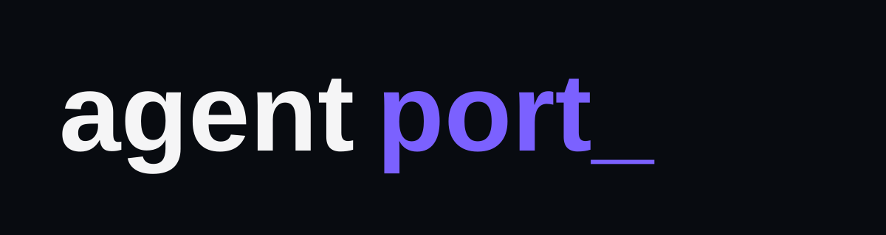
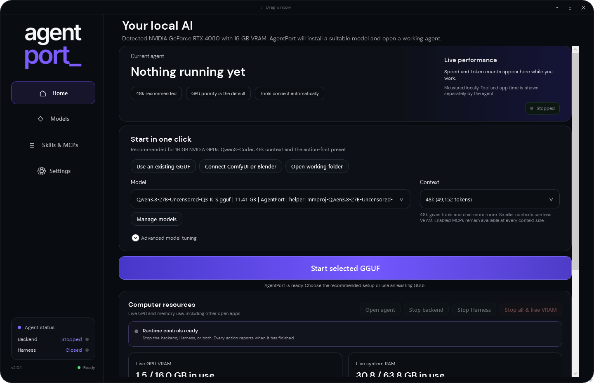

  

  A one-click local AI agent for Windows, NVIDIA GPUs, ComfyUI and Blender.

  <a href="https://github.com/ZURAVFX/AgentPort/releases/latest"><strong>Download AgentPort for Windows</strong></a>
  ·
  <a href="https://github.com/ZURAVFX/AgentPort/releases">Previous versions</a>
  ·
  <a href="LICENSE">MIT licence</a>

## What AgentPort does

AgentPort turns a compatible Windows PC into a private local AI workstation. It can download a recommended model, run it on your NVIDIA GPU, open DeepSeek Harness with the correct model already selected, and connect tools such as ComfyUI and Blender.

- One-click recommended model setup
- Automatic GPU, VRAM and RAM detection
- Live token speed and memory usage
- 48k context on the verified 16 GB setup
- Guided ComfyUI and Blender MCP connections
- Generic MCP JSON import, with no special folder required
- Existing GGUF discovery for users who already have models
- Reliable stop, restart, switching and VRAM release controls
- Separate **Stop backend**, **Stop Harness**, and **Stop all & free VRAM** actions with visible progress

## Quick start

1. [Download the latest `AgentPort.exe`](https://github.com/ZURAVFX/AgentPort/releases/latest).
2. Double-click it and choose **Start recommended local agent**.
3. AgentPort downloads what is missing, starts the model and opens Harness.

The first setup downloads approximately 13.6 GB. Downloads resume if interrupted and are verified before use. AgentPort is not currently code-signed, so Windows may show SmartScreen; choose **More info → Run anyway** only when the file came from this repository.

## Recommended 16 GB setup

AgentPort 2.0 defaults to **Qwen3-Coder 30B-A3B Instruct IQ3_XXS** at **49,152 tokens** through a managed CUDA llama.cpp runtime.

On the tested RTX 4080 16 GB system it completed one autonomous session that created, validated and ran a ComfyUI workflow, then modified and independently verified a Blender 5.2 scene. The weighted generation rate across that test was approximately **104 tokens/second**.

NInfer remains available in **Advanced** for its compatible converted model. It measured roughly 75–80 tokens/second on the same card, but offered less usable context, so it is not the everyday default.

## ComfyUI, Blender and other MCPs

Open **Skills & MCPs → Manage connections** inside AgentPort.

- **ComfyUI:** enter the local ComfyUI address, then choose **Install & connect ComfyUI**.
- **Blender:** enable and start the official Blender Lab MCP add-on, then choose **Install & connect Blender**.
- **Other MCPs:** paste the publisher's standard `mcpServers` JSON. AgentPort supports command-based and Streamable HTTP connections.

Skills and MCPs are kept separate: a skill supplies instructions, while an MCP supplies callable tools. ComfyUI and Blender do not require matching skills.

## Requirements

- Windows 10 or 11
- NVIDIA RTX 30 or 40 series GPU
- 8 GB VRAM minimum; 16 GB recommended for the verified default
- 24 GB system RAM minimum; 32 GB or more recommended
- Approximately 16 GB free disk space for the recommended model and runtime
- Internet access during initial setup

Exact performance and context capacity depend on GPU memory, system RAM and other open GPU applications. The published end-to-end results were measured on Windows with an RTX 4080 16 GB and 64 GB RAM.

AgentPort requests maximum safe GPU offload by default. GGUF model files are memory-mapped, so Windows can show substantial system RAM use even while model layers run on the GPU. AgentPort 2.0.1 shows the reported GPU layer placement directly on Home when available.

## Existing models and advanced options

AgentPort discovers `.gguf` models in common local model folders and lets you run them without copying them. These models are labelled **Unverified** because context size, tool ability and memory needs differ.

Manual model tuning, legacy TextGen controls, NInfer and Hugging Face model downloads are available under **Advanced** without cluttering the first-run experience.

## Privacy

Inference runs locally. AgentPort stores its settings under `%USERPROFILE%\.dsh` and managed runtime files under `%LOCALAPPDATA%\AgentPort`. Model/runtime downloads come directly from their published upstream sources.

## Source and previous versions

The current buildable source is in [`src/`](src/). Git tags and [GitHub Releases](https://github.com/ZURAVFX/AgentPort/releases) preserve previous versions, so the main page can stay focused on the current release.

See the [v2.0 validation record](src/TEAM-RELEASE-CHECKLIST.md) for the completed test gates.

## Licence

[MIT](LICENSE)
