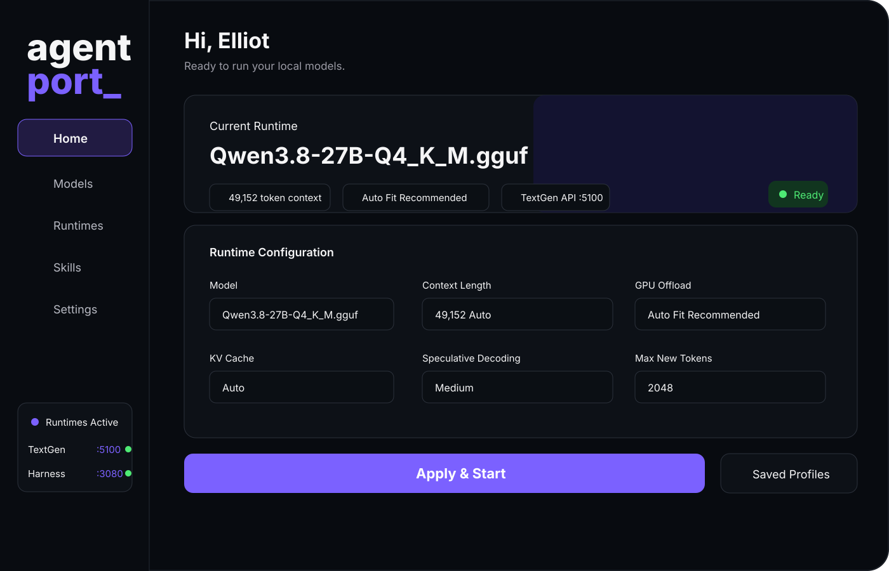

# Public Tools

A collection of free public tools by Elliot / ZURA VFX.

## Tools

### AgentPort

A Windows desktop app for running local GGUF models through TextGen and connecting them into agent-style workflows.

- [Read the AgentPort guide](./AgentPort/README.md)
- [Download AgentPort v1.5.0](./AgentPort/releases/AgentPort_v1.5.0.exe)

